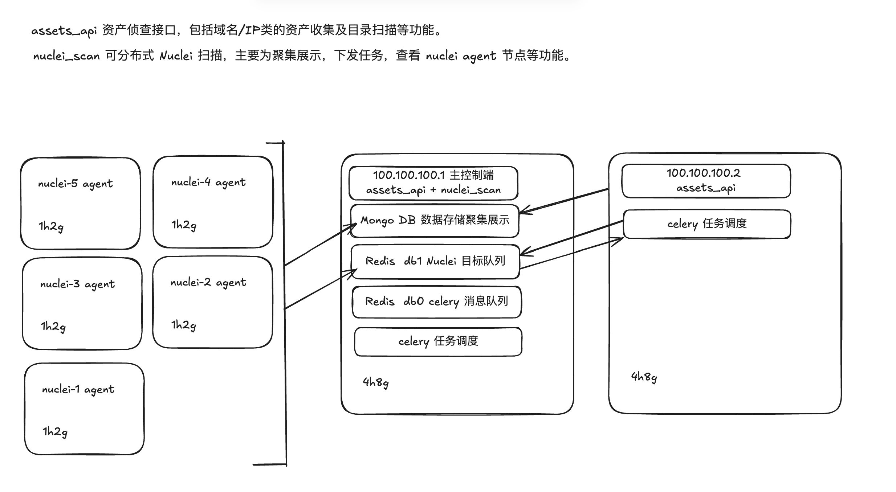
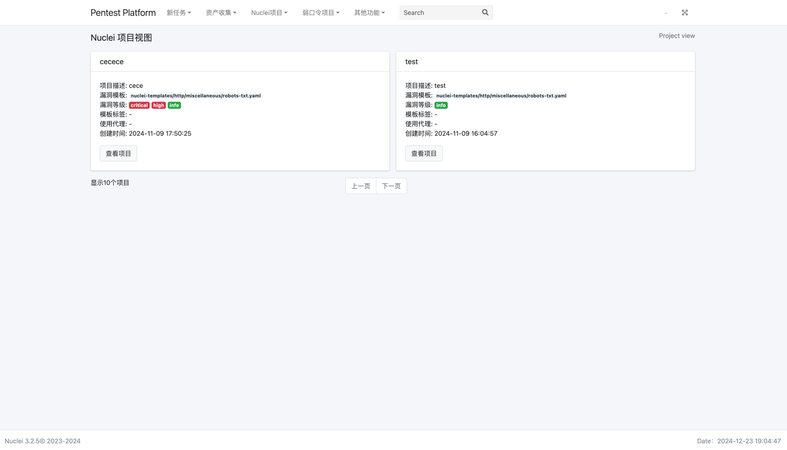
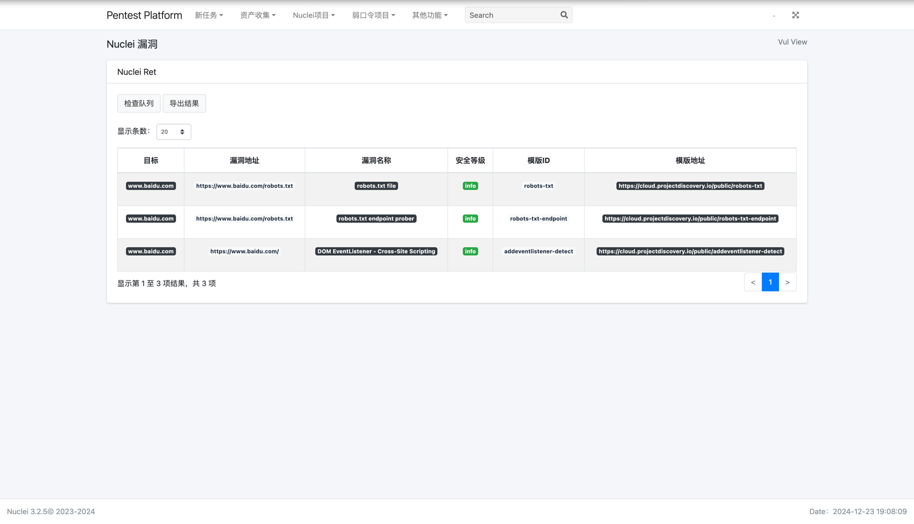
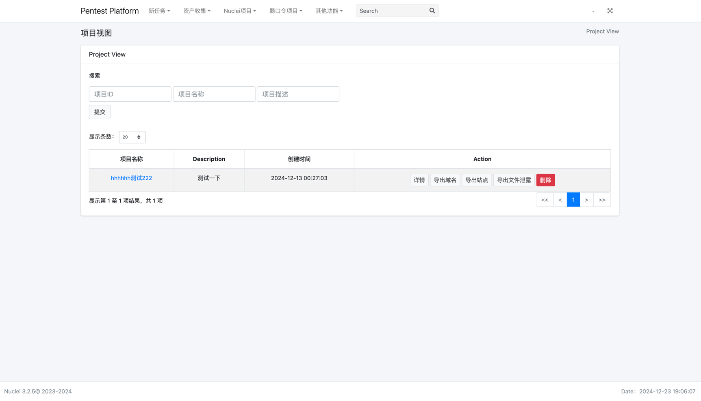
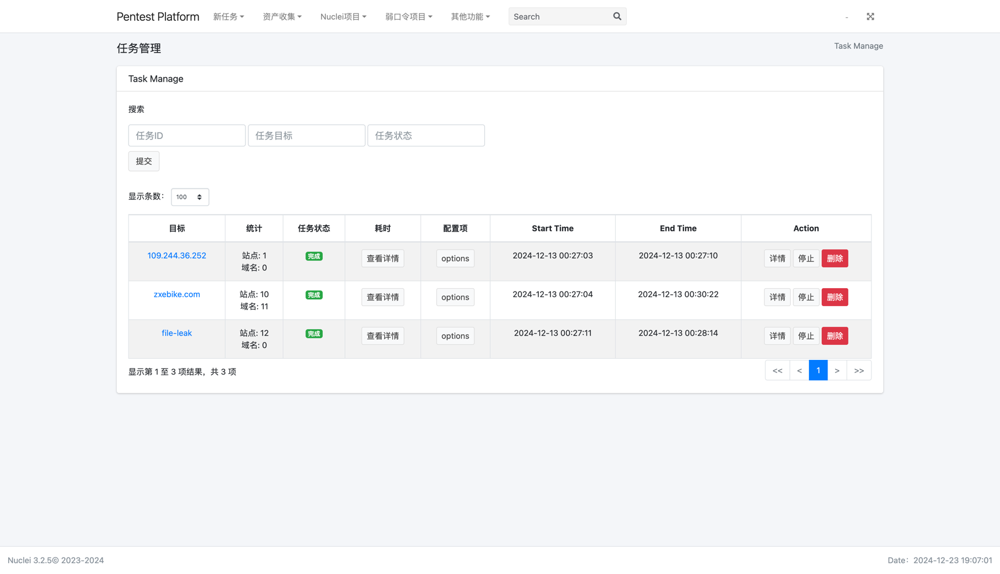
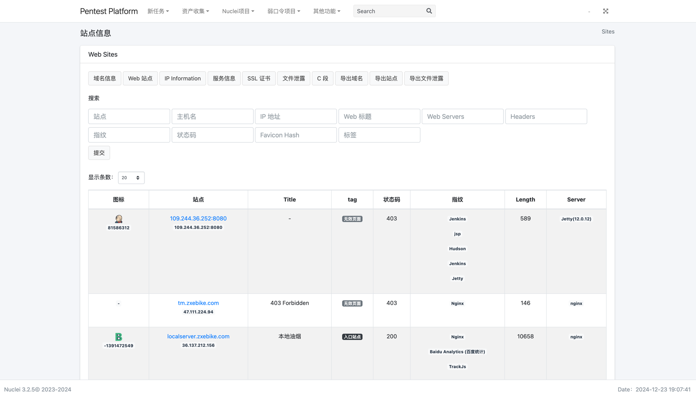

# NucleiPlatform

Nuclei SaaS 化服务并集成了资产扫描系统。

## nuclei-scan 分布式扫描系统

此框架适用于任何基于命令行的扫描器。

## 免责声明

本工具仅限授权安全测试使用，禁止非法攻击未授权站点。
请使用者遵守《中华人民共和国网络安全法》，勿将本项目用于未授权的测试，参与本项目的开发成员不负任何连带法律责任。

### 功能逻辑设计

NucleiPlatform 扫描模块
—> 逻辑设计简单，随时添加目标资产，针对大量资产进行扫描。
—> 支持对资产进行项目分组。
—> 至少两至三台机器去做 Nuclei Agent 分布式扫描。
—> 支持对节点状态，扫描队列的查询。

AssetsDetectAPI 资产收集模块
—> 支持 celery 分布式任务调度。
—> 支持对资产进行项目分组，主要功能流程域名收集（域名爆破和网络测绘）、端口扫描、站点查询、指纹识别、服务识别、证书信息、站点截图、目录扫描。

__主控端服务器建议最低使用 4h8g VPS 服务器，客户端服务器最低使用 4h4g，画的图有偏差因为中途修改了扫描逻辑。__



### 项目部署

测试环境： Ubuntu 24.04.1 LTS 、Python 3.12.3
正常来说会上下兼容，其他操作系统未进行测试（暂且不支持 Windows 系统部署）。

#### 主控端机器

##### 安装基础依赖

```bash
apt update 
apt install python3 python3-dev python3-pip gcc nmap gunicorn screen celery
git clone https://github.com/evilc0deooo/NucleiPlatform.git && cd NucleiPlatform
python3 -m pip install -r requirements.txt --user --break-system-packages
```

##### 永久修改控制文件描述符限制

将下面的 BASH SHELL 脚本保存到服务器并命名为 `init.sh`。

```shell
#!/bin/bash

# 系统
echo 'fs.file-max = 65535' | sudo tee -a /etc/sysctl.conf
sudo sysctl -p

# 用户 cat /etc/security/limits.conf
sudo tee -a /etc/security/limits.conf << EOF
*               hard    nofile          65535
*               soft    nofile          65535
root            hard    nofile          65535
root            soft    nofile          65535
*               soft    nproc           65535
*               hard    nproc           65535
root            soft    nproc           65535
root            hard    nproc           65535
*               soft    core            unlimited
*               hard    core            unlimited
root            soft    core            unlimited
root            hard    core            unlimited
EOF

# Systemd  
# cd /etc/systemd/
# grep -rn -F "DefaultLimitNOFILE"
sudo sed -i '/DefaultLimitNOFILE/c DefaultLimitNOFILE=65535' /etc/systemd/*.conf
sudo systemctl daemon-reexec
# 当前终端修改控制文件描述符限制
sudo ulimit -n 65535
```

执行保存的 BASH SHELL 脚本。
```bash
chmod u+x init.sh
bash init.sh
```

如果永久修改控制文件描述符限制，需要关闭终端重新打开，并用 `ulimit -n` 命令来查看是否修改成功。

##### 临时修改控制文件描述符限制

如果不想重开终端，执行下面的命令即可，并用 `ulimit -n` 命令来查看是否修改成功。

```bash
sudo ulimit -n 65535
```

##### 创建启动 Redis 容器

```bash
docker pull redis:latest
docker run -d --name redis -p 6379:6379 redis:latest --requirepass "redis_password"
```

##### 创建启动 Mongo 容器

```bash
docker pull mongo
docker run -d \
  --name mongodb \
  -p 27017:27017 \
  -e MONGO_INITDB_ROOT_USERNAME=admin \
  -e MONGO_INITDB_ROOT_PASSWORD=mongo_password \
  mongo
```

##### 修改配置

修改 config.py 文件中的配置。

```
AUTH_USERNAME -> 平台认证账户
AUTH_PASSWORD -> 平台认证密码

REDIS_HOST -> Redis 主机 IP
REDIS_PORT -> Redis 主机端口
REDIS_PWD -> Redis 密码

MONGO_HOST -> Mongo 主机 IP
MONGO_PORT -> Mongo 主机端口
MONGO_PWD -> Mongo 密码
```

##### 启动 Nuclei Web 服务

```bash
screen python3 app.py
```

#### Agent 客户端机器

Agent 客户端服务器需要重复操作上面的安装流程（**⚠️注意：不需要重复安装 Docker 内的数据库相关服务**）。

__修改配置__

修改 `config.py` 文件中的数据库相关配置让其可连接主控端。

```
REDIS_HOST -> 主控端 Redis 主机 IP
REDIS_PORT -> 主控端 Redis 主机端口
REDIS_PWD -> 主控端 Redis 密码

MONGO_HOST -> 主控端 Mongo 主机 IP
MONGO_PORT -> 主控端 Mongo 主机端口
MONGO_PWD -> 主控端 Mongo 密码
```

__运行 Nuclei Agent 客户端__

```bash
cd NucleiPlatform
screen python3 nuclei_agent.py
screen python3 zombie_agent.py
```

## 系统界面 DEMO











